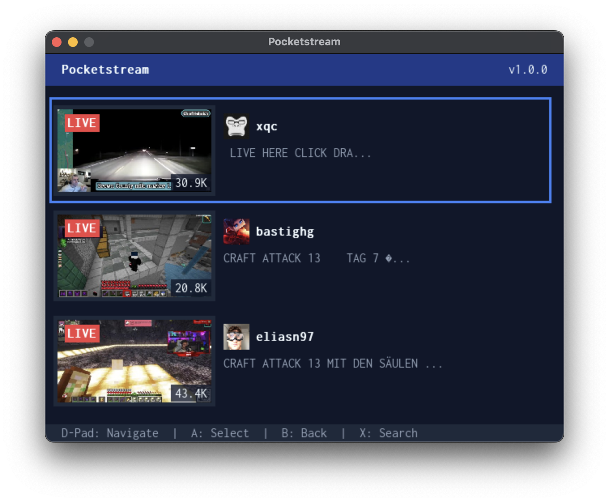
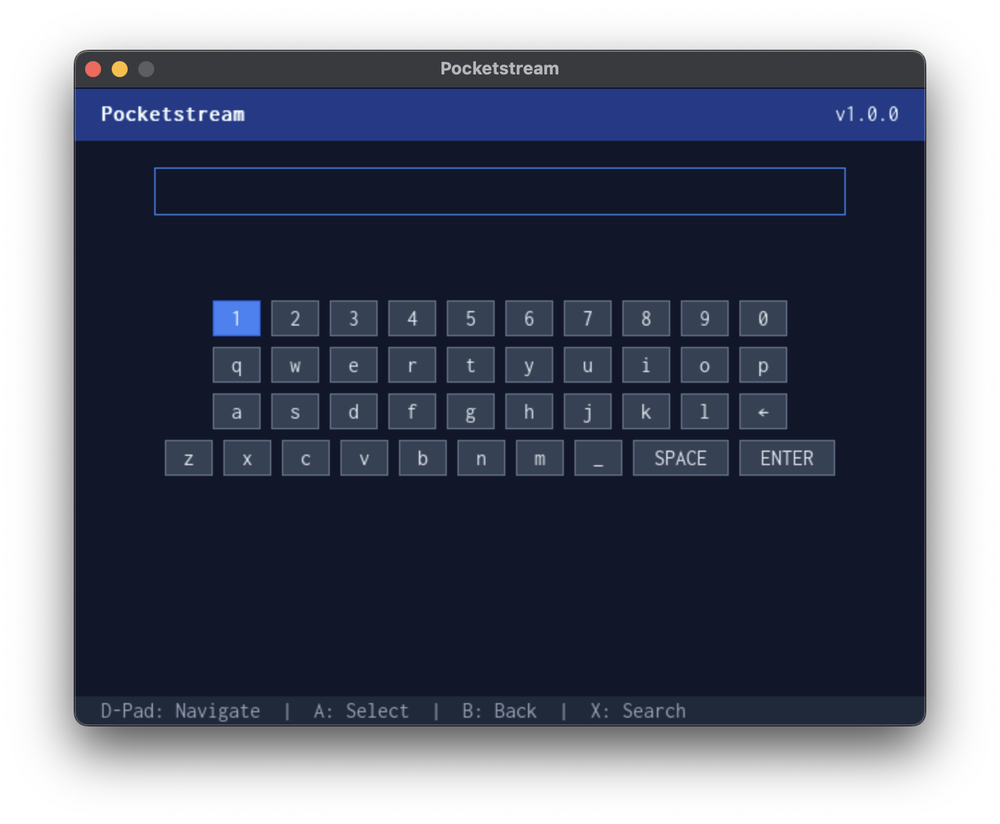

# 📺 Pocketstream

**PocketStream** is a lightweight, open-source Twitch client written in **Go** with **SDL2**.  
It lets you browse and watch live Twitch streams without needing to log in.

> ⚠️ PocketStream is **not affiliated with or endorsed by Twitch Interactive, Inc.**  
> This software uses publicly available Twitch APIs and is provided for educational and personal use only.

---

## ✨ Features

- 🔝 View the **Top 10 live Twitch streams** in real time
- 🔍 **Search** for live streams by keyword
- ▶️ **Play live streams** directly with `ffplay`
- 💡 No login required
- 🧩 Built with:
    - [Go](https://golang.org/)
    - [go-sdl2](https://github.com/veandco/go-sdl2)
    - [FFmpeg / FFplay](https://ffmpeg.org/ffplay.html)

---

## 💻 Supported Devices

PocketStream is designed to run efficiently on low-power or handheld Linux-based systems.

| Device | Status | Notes |
|:--------|:--------:|:------|
| **Anbernic RG35XX** | ✅ Supported | Optimized for 640×480 resolution |

---

## 💾 Download & Install on Anbernic RG35XX

A prebuilt release of **PocketStream** for the Anbernic RG35XX is available on GitHub:

1. Go to the [Releases page](https://github.com/fspasovski/pocketstream-app/releases/tag/rg35xx).
2. Download the latest **.muxzip archive** for RG35XX.
3. Copy the `Pocketstream.muxzip` archive to `/mnt/mmc/ARCHIVE` on your device
4. Open the `Pocketstream.muxzip` through the `Archive Manager` application

---

## 🚀 Development

### Requirements
- Go 1.23+
- SDL2 development libraries
- FFmpeg (for `ffplay` playback)

### Clone & Run

```bash
git clone git@github.com:fspasovski/pocketstream-app.git
cd pocketstream-app
go run main.go
```

### Build for Anbernic RG35XX
This will generate the `Pocketstream` folder, ready to be transferred on your device.
It uses a Docker container in order to build the app for the target platform.
```bash
./build.sh
```

---

## 🖼️ Screenshots

<p align="center">
  
  
</p>

## 🧡 Support My Work

If you enjoy **PocketStream** and want to support future updates and projects,  
you can **buy me a coffee** here:

👉 [**buymeacoffee.com/fspasovski**](https://buymeacoffee.com/fspasovski)

<p align="center">
  <a href="https://buymeacoffee.com/fspasovski" target="_blank">
    
  </a>
</p>
